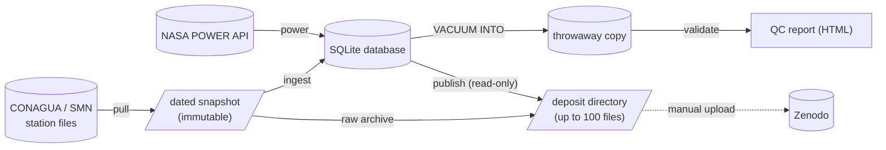
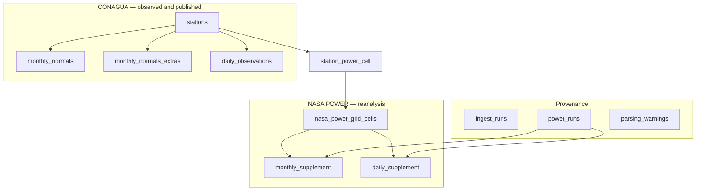

# conagua-etl

`conagua-etl` builds **BioclimaMX Stations**, a citable dataset of Mexican
climate station records. It downloads the climatological station files that
CONAGUA's Servicio Meteorológico Nacional (SMN) publishes, loads them into a
SQLite database, adds NASA POWER reanalysis for each station's grid cell, and
writes a ready-to-upload Zenodo deposit.

It is one self-contained Go binary with no C dependencies. It treats the
source politely and the data strictly:

- **Polite to CONAGUA.** Requests go out one at a time at about one per
  second, with jitter and periodic rests, and can never exceed five per
  second whatever the flags say. Only transient failures are retried.
- **Never loses work.** Every step is idempotent and resumable. Files are
  written atomically, and a dated snapshot is never modified.
- **Faithful to the source.** Values are stored as CONAGUA publishes them,
  a gap stays empty (`NULL`) and is never filled in, and the table a value
  lives in says where it came from: CONAGUA observation or NASA POWER
  reanalysis.

## How it works



| Verb | What it does |
|---|---|
| `pull` | Downloads the CONAGUA catalog and every station file into a dated snapshot: a local directory, or Cloudflare R2. Interrupt it at any time; re-running with the same flags resumes. |
| `mirror` | Copies a snapshot's files from the sink to the local root, checking each against the sha256 recorded at pull time. With the local sink it only checks the files in place. |
| `ingest` | Parses a snapshot into the database: stations, the published normals and extremes, and the daily observations, plus WMO completeness scores. |
| `power` | Adds NASA POWER reanalysis: 31 variables per grid cell, as a monthly climatology for a reference period, or as a daily series. |
| `validate` | Runs the quality-control rules and writes a self-contained HTML report. It **modifies** the database it is given, so run it on a copy. |
| `publish` | Builds the deposit from the database. It only reads the database, and it first runs an integrity check that refuses to build if anything is inconsistent. |

`conagua-etl <verb> --help` is the full reference for every flag.

### What the database holds

The table a row lives in says where its values come from.



Each station is linked to the NASA POWER grid cell (0.5° × 0.625°) it falls in
through `station_power_cell`. Every reanalysis row points to the `power_runs`
row that fetched it, and every run records the commit of the binary that ran
it.

## Install

Download the archive for your platform from the
[Releases](https://github.com/bioclimamx/conagua-etl/releases) page and check
it against the published checksums:

```sh
sha256sum --check --ignore-missing SHA256SUMS
tar -xzf conagua-etl_<version>_linux_amd64.tar.gz
./conagua-etl --version
```

On macOS, use `shasum -a 256 --check --ignore-missing SHA256SUMS`.

Use a release binary to build a deposit you intend to publish. `publish`
records the commit the binary was built from in every artifact, and release
binaries are built from the tagged commit. A binary from `go install` or
`go run` carries no commit, so its deposit records an empty `etl_git_sha`. A
binary built from a checkout with uncommitted changes is refused outright.

To build from source (Go 1.26.1 or newer):

```sh
git clone https://github.com/bioclimamx/conagua-etl
cd conagua-etl
make build        # writes ./build/conagua-etl
```

## Building the dataset

A full national run needs about 55 GB of free disk: the snapshot is about
2 GB, the database about 10 GB, and the deposit about 30 GB, plus a
temporary copy of the database while `publish` builds the national archive.
The times below are for the full national archive at the default rates.

```sh
# 1. Snapshot every CONAGUA station file (~12 h). Resumable.
conagua-etl pull --snapshot-date 2026-08-30

# 2. Load it into a new database (minutes).
conagua-etl ingest --snapshot 2026-08-30 --db ./bioclima.db

# 3. Add NASA POWER: two monthly climatologies and the daily series (~2 h).
conagua-etl power --db ./bioclima.db --temporal monthly --start-year 1991 --end-year 2020
conagua-etl power --db ./bioclima.db --temporal monthly --start-year 1981 --end-year 2010
conagua-etl power --db ./bioclima.db --temporal daily

# 4. Optional: run quality control on a copy, never on the database itself.
sqlite3 "file:bioclima.db?mode=ro" "VACUUM INTO 'bioclima-qc.db'"
conagua-etl validate --db ./bioclima-qc.db --report ./validate-report.html

# 5. Build the deposit (~1 h) into a new, empty directory. --doi is the DOI
#    reserved on the Zenodo draft the deposit will be uploaded to.
conagua-etl publish --db ./bioclima.db --out ./deposit --doi 10.5281/zenodo.NNNNNNN
```

Reserve the DOI on the Zenodo draft first (Zenodo shows it before
publishing) and pass it bare. It is written into the citation,
`CITATION.cff`, `manifest.json` and every station profile, none of which can
be edited once the record is published. Without `--doi` the deposit carries
no DOI at all.

`--root` (default `./snapshots`) is where snapshots live; `publish` reads the
snapshot from there to build the raw archive. To keep snapshots in Cloudflare
R2 instead, pass `--sink r2` and set `R2_ACCOUNT_ID`, `R2_ACCESS_KEY_ID`,
`R2_SECRET_ACCESS_KEY` and `R2_SNAPSHOTS_BUCKET`, either in the environment
or in a `.env` file in the working directory. `mirror` brings an R2 snapshot
back to the local root.

To try the pipeline without the full archive, restrict it:
`pull --state tlax`, then `ingest`, `power --max-cells 5`, and
`publish --state tlax`.

### Exit codes

| Code | Meaning |
|---|---|
| `0` | The run completed cleanly. |
| `1` | The run failed, or was refused: for example, `publish`'s integrity check found an error, or `validate` found an error-level finding. |
| `2` | `ingest`, `power` or `publish` completed, but some stations, grid cells or artifacts failed; each failure is reported. Fix the cause and re-run. |

`pull` lists any files it could not download and still exits `0`; re-run it
with `--retry-failed` to try them again.

### A note on CONAGUA's server

The SMN site's TLS certificate chain has been broken for a long time, so
certificate verification is turned off for that host only. Every downloaded
file is instead checked by content: its sha256 is recorded in the snapshot
ledger (`_index.json`), which ships inside the deposit. The client identifies
itself with a browser user agent, because the site rejects non-browser
clients.

## The deposit

`publish` writes a directory ready to upload to Zenodo. It also includes its
own README, a data dictionary, a QA report, and the license and credit files.

| Files | Contents |
|---|---|
| `<state>-tabular.zip` (×32) | CSV per station and per grid cell, one Parquet file per table, and a SQLite database with just that state |
| `<state>-json.zip` (×32) | A `profile.json` and a `daily.json` for each station |
| `national-csv.zip`, `national-parquet.zip`, `national-json.zip` | The same data for the whole country |
| `national-sqlite.zip` | The complete database |
| `conagua-raw-<date>.zip` | The snapshot exactly as downloaded |
| `README.md`, `DATA-DICTIONARY.md`, `DATA-DICTIONARY.json`, `QA-REPORT.md` | Documentation of the dataset |
| `LICENSE`, `NOTICE`, `CITATION.cff`, `zenodo-metadata.json` | License, source credits, citation, and the Zenodo metadata to enter |
| `manifest.json`, `CHECKSUMS` | What was built, from what, and every file's sha256 |

The dataset is licensed CC BY 4.0 on the compilation. The source data keep
their own terms: CONAGUA's under the Términos de Libre Uso MX, and NASA
POWER's in the public domain. The deposit's `NOTICE` gives both credits in
full.

## Development

```sh
make check        # gofmt, go vet, golangci-lint, tests, and the CGo-free build
```

`make check` needs [golangci-lint](https://golangci-lint.run/) v2. Tests use
[Ginkgo](https://onsi.github.io/ginkgo/) and
[Gomega](https://onsi.github.io/gomega/). Some test fixtures are real CONAGUA
files; `NOTICE` lists them and the terms they remain under.

Every push to `main` and every pull request runs `make check`
(`.github/workflows/ci.yml`). Publishing a GitHub release runs
`.github/workflows/release.yml`: it runs `make check`, builds the binaries
for Linux, macOS and Windows on amd64 and arm64, checks that each one
records the release commit and a clean tree, and attaches the archives and
`SHA256SUMS` to the release. Deposits are always built locally, never in CI.

## License

The code is licensed under the [MIT License](LICENSE). The test fixtures
taken from CONAGUA, and the dataset this program produces, are covered by
their own terms: see [NOTICE](NOTICE).
